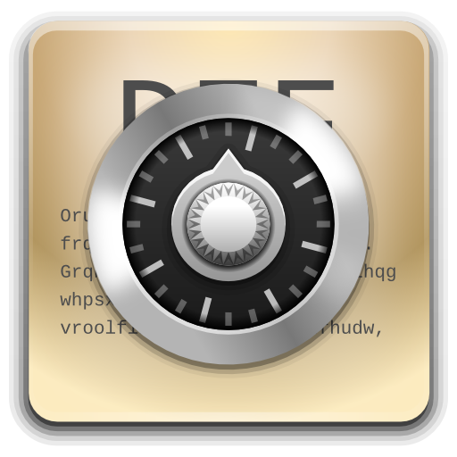

# DataCipher

Utilidad de cifrado de texto.

- ASCII binario, octal, decimal, y hexadecimal.
- Cifrado Atbash.
- Cifrado Caesar.
- Cifrado Vigenère.
- Transposición columnar.

## Instalación

Para instalar la versión gráfica (GUI):
1. Descargar el ejecutable para su sistema operativo:
  - Windows (pronto)
  - [Linux](https://github.com/S8A/datacipher/raw/master/dist/datacipher_gui)
2. Ejecutar el archivo descargado.

Para instalar la versión de línea de comandos (CLI):
1. Descargar el ejecutable para su sistema operativo:
  - Windows (pronto)
  - [Linux](https://github.com/S8A/datacipher/raw/master/dist/datacipher_cli)
2. Ejecutar el archivo descargado.

## Uso - Versión gráfica (GUI)

1. Seleccionar el tipo de cifrado en la barra de pestañas.
2. Establecer las opciones deseadas.
3. Ejecutar.

## Uso - Versión de línea de comandos (GUI)

1. Escribir `help` para obtener leer guía de comandos y opciones disponibles.
2. Usar los comandos y opciones deseados.

